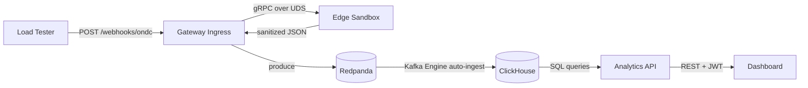

# Architecture

## Data Flow

## Component Details

### Gateway Ingress (Go)
- Receives Beckn protocol webhooks
- Validates JSON structure (`context.action` field)
- Routes to Edge Sandbox for PII redaction
- Publishes sanitized events to Redpanda
- Graceful degradation: if sandbox is down, uses Go-side basic redaction

### Edge Sandbox (Rust)
- gRPC server on Unix Domain Socket (zero network overhead)
- Wasmtime runtime for sandboxed policy execution
- PII redaction: SHA256 phone hashing, GPS fuzzing (±1km)
- Designed for future WASM policy hot-reloading

### Redpanda
- Kafka-compatible streaming (single binary, no JVM/Zookeeper)
- Topic: `ondc_events_sanitized` (3 partitions)
- Acts as async buffer between ingestion and storage

### ClickHouse
- Kafka Engine table auto-consumes from Redpanda
- MergeTree storage partitioned by month
- Pre-built aggregation views for funnel and cancellation metrics

### Analytics API (Go)
- JWT-authenticated REST endpoints
- Parameterized ClickHouse queries
- CORS-enabled for frontend consumption

### Dashboard (React)
- Login-gated SPA
- Real-time data via TanStack Query (auto-refresh)
- Funnel chart, volume chart, cancellation table, recent events
- Dark mode glassmorphism design
